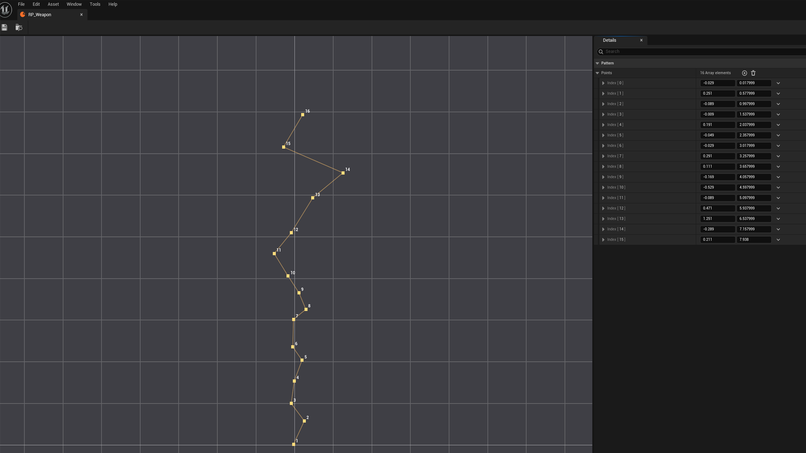

# FPS Weapon Feel

> Procedural FPS weapon motion for Unreal Engine 5. Drop-in component. Sensitivity-invariant recoil. Framerate-independent. Network-ready.

[](https://www.unrealengine.com/)
[](#)
[](#license)

[](https://youtu.be/Y64iqB50EkQ)

▶ **[Watch the demo on YouTube](https://youtu.be/Y64iqB50EkQ)** &nbsp;|&nbsp; 🎮 **[Download playable test build](https://drive.google.com/file/d/1yBWzZa6JJia65RZ-lGnIGux_5tlnMu7W/view?usp=sharing)**

---

## Why this plugin

Building good FPS weapon feel from scratch is a pile of small problems that all have to work together: rotation lag that doesn't twitch, breathing that fades during movement, walk bob that locks to the ground, recoil that lifts the view *and* the gun, recovery that doesn't pop, and motion that looks the same on 30 FPS and 144 FPS.

**FPS Weapon Feel** solves all of these in one component. Attach it under your camera, cache your weapon's profile via `InitializeRecoilData`, call `FireShot()` on every bullet, and you're done. No tick orchestration, no replication boilerplate, no math.

---

## Features

- **Procedural motion stack** — rotation lag, movement tilt/lag, idle breathing, walk bob, all blended into one transform.
- **Per-shot recoil** — view kick + mesh kick (offset & tilt), with optional recoil patterns.
- **Custom Recoil Pattern asset** — author 2D spray curves in a built-in editor, hot-reload, share across weapons.
- **Sensitivity-invariant** — recoil applied via direct ControlRotation; the same kick value lifts the view by the same number of degrees regardless of mouse DPI, `InputPitchScale`, or `bInvertMouse`.
- **Framerate-independent** — true exponential smoothing, not Unreal's linear `*InterpTo` approximation. Identical trajectories at any FPS.
- **Per-weapon profiles** — `FRecoilProfile` carries all weapon-specific data. Pass a different profile per gun.
- **Network-safe** — Tick and FireShot are no-ops on remote proxies and the server.
- **Blueprint-first** — every method is `BlueprintCallable`, every property is `BlueprintReadWrite`. No C++ required.

---

## Quick Start

1. Add `FPS Weapon Feel Component` under your camera.
2. Place your weapon mesh as a child of the component.
3. On weapon equip, call `InitializeRecoilData` with the weapon's `FRecoilProfile`.
4. On each shot, call `FireShot`.
5. On burst end, call `EndFire`.

That's it.




---

## API at a glance

```cpp
// One component per character, lives under the camera
UFPSWeaponFeelComponent

  void InitializeRecoilData(const FRecoilProfile& Profile)  // call on weapon equip / profile change
  void FireShot()                                            // call per bullet
  void EndFire()                                             // call when burst ends
  void ResetState()                                          // call on respawn / teleport

  // Per-character feel (set once, tweak in editor)
  RotationLag*, Movement*, Breathing*, WalkBob*
  Intensity                                                  // 0..1, smoothly interpolated (lower for ADS)
  GlobalRecoilScale                                          // master recoil multiplier

// Per-weapon recoil profile (passed into InitializeRecoilData)
FRecoilProfile
  Strength, MeshRecoverySpeed, PatternResetDelay
  ViewPitchKick, ViewYawSpread                               // direct degrees
  RecoilPattern                                              // optional URecoilPattern asset
  BackOffset, UpOffset, SideOffset                           // mesh translation kick
  MeshPitchKick, MeshYawKick, MeshRollKick                   // mesh rotation kick
```

Full API reference, examples, and best practices ship inside the plugin in `README.md`.

---

## Recoil Pattern asset

Author 2D point curves describing the per-shot view positions of a weapon's spray. Each `(X=Yaw, Y=Pitch)` point is in **degrees**. The component applies the delta between consecutive points each shot, so the view follows the authored curve. After the last point, it falls back to randomized kick (`ViewPitchKick + ViewYawSpread`).

Patterns are **per-weapon assets** — make one for each gun, drop into the corresponding `FRecoilProfile.RecoilPattern` and cache the profile via `InitializeRecoilData` on equip.

---

## Requirements

- Unreal Engine **5.7**
- Windows 64-bit (other platforms on request)
- Works in C++ and Blueprint projects

---

## Try it / Buy it

- 🎮 [**Download playable test build**](https://drive.google.com/file/d/1yBWzZa6JJia65RZ-lGnIGux_5tlnMu7W/view?usp=sharing) — packaged demo, no engine required
- ▶ [Watch the demo on YouTube](https://youtu.be/Y64iqB50EkQ)
- 🛒 Fab listing — *coming soon*

---

## Support

- Bugs / requests → [GitHub Issues](https://github.com/HawkDev15/FPS_Weapon_Feel/issues)
- Email → kyrylo.kabak@gmail.com
- See [CHANGELOG.md](CHANGELOG.md) for version history

---

## License

The **plugin itself** (source code, assets, binaries) is sold under a commercial Fab license — see the Fab listing for terms.

The **documentation in this repository** (README, CHANGELOG, images) is released under the [MIT License](LICENSE), so you can quote it freely.

---

**Author:** [Lamedev](https://www.linkedin.com/in/kyrylo-kabak-a3a2a5194) (Kyrylo Kabak)
